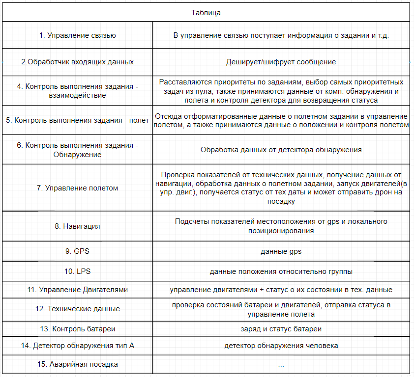
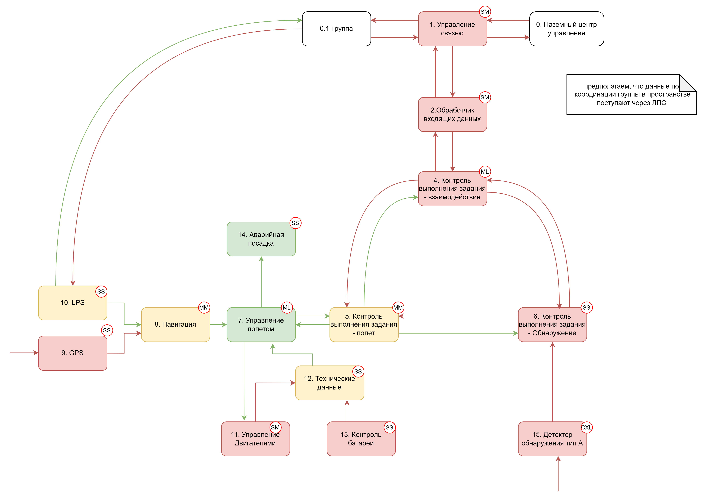
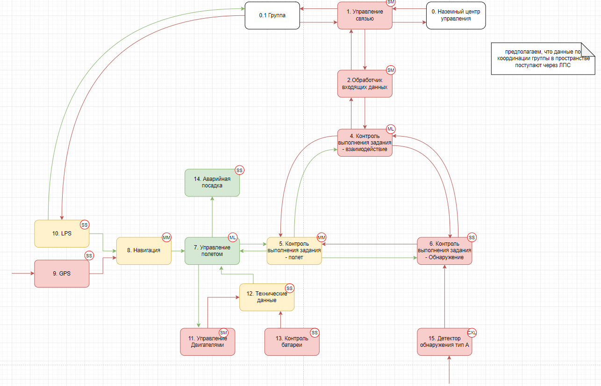
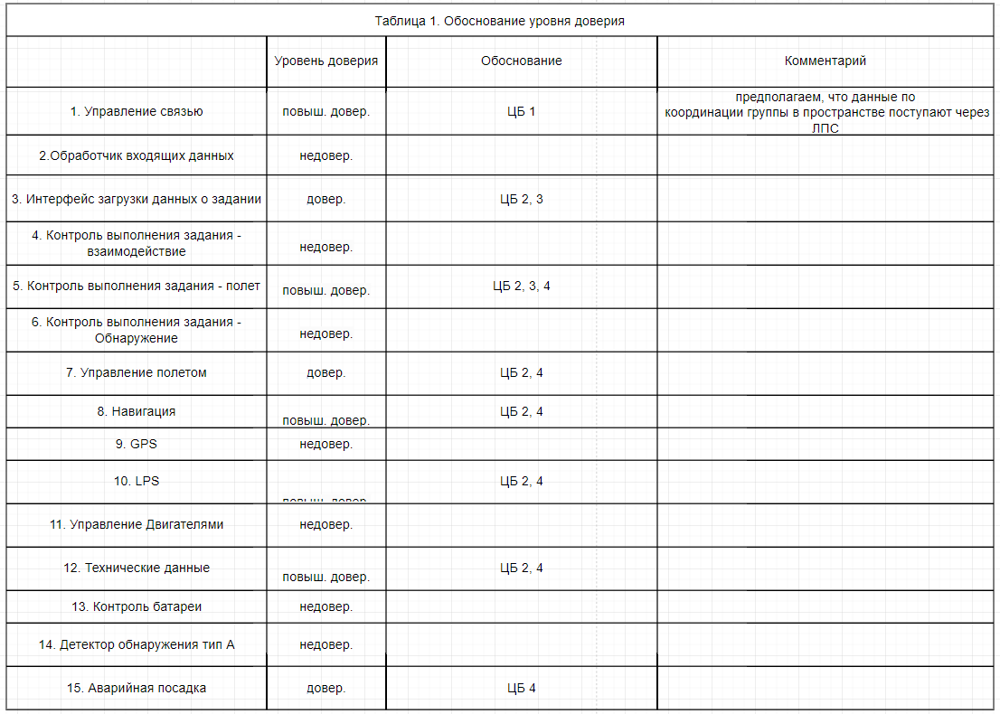

# Отчёт о выполнении задачи "Dec-drone-ctrl"

- [Отчёт о выполнении задачи "Dec-drone-ctrl"](#отчёт-о-выполнении-задачи-dec-drone-ctrl)
  - [Постановка задачи](#постановка-задачи)
  - [Известные ограничения и вводные](#известные-ограничения-и-вводные)
    - [Цели и Предположения Безопасности (ЦПБ)](#цели-и-предположения-безопасности-цпб)
      - [Цели безопасности](#цели-безопасности)
      - [Предположения](#предположения)
  - [Архитектура решения](#архитектура-решения)
    - [Компоненты](#компоненты)
      - [Монитор безопасности (security monitor)](#монитор-безопасности-security-monitor)
    - [Алгоритм работы решения](#алгоритм-работы-решения)
    - [Описание cценариев (последовательности выполнения операций), при которых ЦБ нарушаются](#описание-cценариев-последовательности-выполнения-операций-при-которых-цб-нарушаются)
      - [Негативный сценарий 1.](#негативный-сценарий-1)
      - [Негативный сценарий 2.](#негативный-сценарий-2)
    - [Политика архитектуры ](#политика-архитектуры-)
      - [Обоснование политики архитектуры ](#обоснование-политики-архитектуры-)
  - [Запуск приложения и тестов](#запуск-приложения-и-тестов)
    - [Запуск приложения](#запуск-приложения)
    - [Запуск тестов](#запуск-тестов)
  - [Выводы по курсу](#выводы-по-курсу)

## Постановка задачи

Децентрализованная система управления группой беспилотников представляет собой программное решение, которое позволяет координировать действия нескольких беспилотных летательных аппаратов без центрального контролирующего узла. 

Основное назначение данной системы заключается в обеспечении автономности и гибкости при выполнении поисково-спасательных миссий на различной местности: в лесу, в городе, в горах, на воде.

## Известные ограничения и вводные

По условиям заказчиков, система должна работать на определенной местности (в лесу, городе, горах, на воде)

### Цели и Предположения Безопасности (ЦПБ)


#### Цели безопасности

1. Выполняются только аутентичные команды

2. Полет и все маневры выполняются согласно ограничениям в полётном задании (высота, полётная зона/эшелон)

3. Выполняются только авторизованные системой ОрВД задания

4. В любой ситуации исключено повреждение наземной инфраструктуры и причинение вреда здоровью человека 

#### Предположения

1. Аутентичная система выдачи заданий благонадежна 

2. Аутентичные сотрудники благонадёжны и обладают необходимой квалификацией

3. Только авторизованные сотрудники управляют системами

## Архитектура решения

### Компоненты



## Базовый сценарий


#### Монитор безопасности (security monitor)
# Security Monitor Policies

| Source             | Destination         | Operation             | Auth |
|--------------------|---------------------|-----------------------|------|
| connection         | data_processing     | data_processing       | True |
| data_processing    | connection          | data_outputting       | True |
| data_processing    | cooperation_tasks   | three_in_one          | True |
| cooperation_tasks  | cooperation_plane   | plane_data            | True |
| cooperation_tasks  | data_processing     | plane_data            | True |
| cooperation_tasks  | data_processing     | detection_data        | True |
| cooperation_tasks  | data_processing     | task_data             | True |
| detector-control   | cooperation_tasks   | detection_data        | True |
| cooperation_plane  | flight_control      | plane_data            | True |
| cooperation_plane  | cooperation_tasks   | plane_data            | True |
| flight_control     | emergency_landing   | alert                 | True |
| flight_control     | motor_control       | movement_data         | True |
| flight_control     | cooperation_tasks   | movement_data         | True |
| motor_control      | technical_data      | motor_status          | True |
| battery_control    | technical_data      | battery_status        | True |
| technical_data     | flight_control      | tech_data             | True |
| navigation         | flight_control      | location_data         | True |
| lps                | navigation          | lps_location_data     | True |
| gps                | navigation          | gps_location_data     | True |


### Алгоритм работы решения

Алгоритм решения представляет из себя базовый вариант реализации без технических деталей, вроде распределения заданий по приоритетам, просчета сетки координат и т.д. и т.п. Текущее решение представляет из себя реализацию компонентов и передачу между ними сообщения в соответсвии (или хотя бы приближенно, насколько возможно) с логикой базового сценарий и политикой архитектуры.

### Описание cценариев (последовательности выполнения операций), при которых ЦБ нарушаются


#### Негативный сценарий 1.

Нарушение ЦБ №2 Контроль батареи


#### Негативный сценарий 2.

Нарушение ЦБ № 3, 4 Контроль выполения задания


### Политика архитектуры 



#### Обоснование политики архитектуры 




## Запуск приложения и тестов

### Запуск приложения

1) Клонируйте репозиторий 
```
git clone https://github.com/st1gmat/dec-drone-ctrl.git
```
2) При помощи makefile вы можете локально поднять контейнеры
```
make run
```
или

```
docker-compose up -d
```

### Запуск тестов

Тесты находятся в папке tests. Для их запуска можно воспользоваться командой `make test`, находясь в директории в корневой дериктории (dec-drone-ctrl)

Можно запустить только один кокретный тест c помощью команды `pytest -svk <name>`, где вместо `<name>` нужно вставить название необходимого теста.

Представлен следующий тест:
1) Unit-тесты политик безопасности (tests/unit/monitor_test/test_unit_monitor.py)

## Выводы по курсу

Курс был интересным и полезным, он познакомил нас с основами кибербезопасности и киберимунной разработки. Было интересно строить
архитектуру, продумывать, корректировать аспекты системы при все более ясном понимании того, что мы хотим видить в итоге. Большим
плюсом было ознакомление с новыми концепциями mils и flask, а также улучшение навыков технической реализации этих концепций: работа с docker, kafka и python, в целом.

## Drawio файл
https://drive.google.com/file/d/1x9zZuE89Sg-x_UE4iEFtCxJvd-E67o1k/view?usp=sharing


